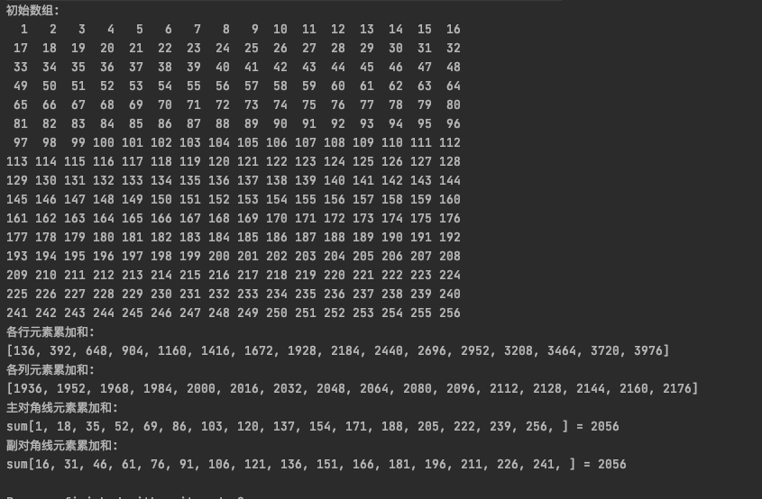
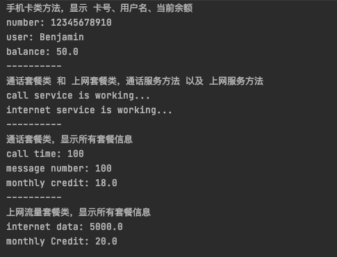
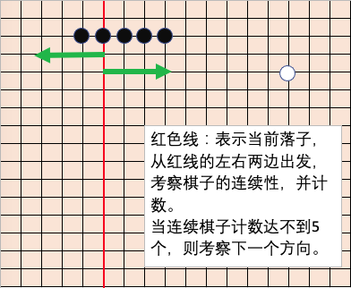
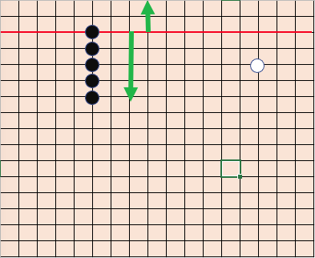
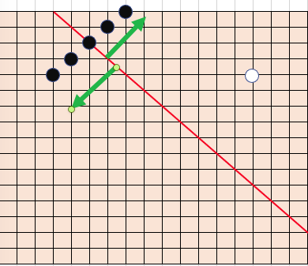

# 作业讲解

## 1. 数组累计求和

运行结果：

## 2. 手机卡和套餐

运行结果：

## 3. 五子棋

- Gomuko.java  五子棋类
- GomukoGame.java  五子棋游戏类

主要讲解如何判断落子后，是否达到五子

- 每个落子位置，有4个方向：行方向、列方向、主对角线方向、副对角线方向
- 分别考察这4个方向的棋子连续情况

如下图：

运行结果见验证视频

