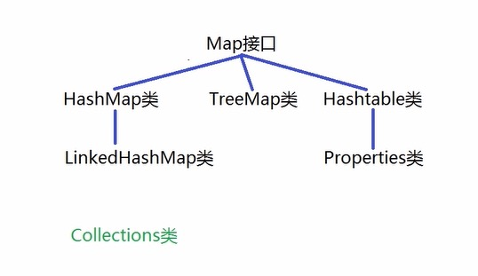

# java 核心类库 一

[TOC]

## 一、常用类的使用

### 1. 常用的包

#### 1.1 常用的包
- java.lang java语言的核心包，由JVM自动导入(System, String)
- java.util 工具包，提供了大量工具类和集合类等(Scanner, Random, List集合类)
- java.io 输入输出包，提供了大量读写文件相关的类(FileInputStream, FileOutputStream)
- java.net 网络包，提供网络编程相关的类(ServerSocket, Socket)
- java.sql 数据包，提供操作数据的类和接口等(DriverManager, Connection)

#### 1.2 Object类

基本概念:

- java.lang.Object类，是java语言中类层次结构的根类, 所有类的默认父类都是 Object

常用方法：

| 方法 | 功能 |
| :-- | -- |
| Object() | 无参构造方法 |
| boolean equals(Object obj) | 用于判断调用对象是否与参数对象相等<br /> 默认比较两个对象的地址是否相等(与 == 运算符结果一致) <br /> 若要比较对象的内容，需要重写次方法 <br /> 该方法重写后，还需要重写hashCode方法，保证结果的一致性 |
| int hashCode() | 返回对象的哈希码 <br /> 如果两个对象根据equals方法相等，则生产相同的整数结果 <br /> 否则不同 |
| String toString() | 获取调用对象的字符串形式 <br /> 该方法默认从返回的字符串为：包名.类名@哈希码的十六进制形式 <br /> 重写为返回意义清晰的方法 <br /> 使用print或println打印引用或者字符串拼接时默认调用 |
| Class<?> getClass() | 返回调用对象的类 |

### 1.3 Integer 类

成员变量: 

| 成员变量 | 表示内容 |
| :-- | -- |
| MAX_VALUE | int类型可描述的最大值 |
| MIN_VALUE | int类型可描述的最小值 |
| SIZE | 表示int类型采用二进制补码形式的位数 |
| BYTES | 表示int类型所占的字节个数 |
| TYPE | 表示int类型的Class实例 |

常用的方法：

| 方法 | 功能 |
| :-- | --| 
| Integer(int value) | 根据参数指定的整数来构造对象 |
| Integer(String s) | 根据参数指定的字符串构造对象 |
| valueOf(int value) | 根据参数指定的整数来构造对象 |
| valueOf(String s) | 根据参数指定的字符串构造对象 |
| intValue(Integer it) | 返回Integer类型的对象的整数值 |
| bolean equals(Object obj) |  |
| String toString() |  |
| static int parseInt(String s) | 字符串类型 -> int类型 |
| static String toString(int i) | int -> 十进制字符串形式 |
| static String toBinaryString(int i) | int -> 二进制字符串形式 |
| static String toHexString(int i) | int -> 十六进制字符串形式 |
| static String toOctalString(int i) | int -> 八进制字符串形式 |

Integer 类的装箱和拆箱机制:

- 装箱：使用 valueOf 方法，从 int 类型 到 Integer 类型
- 拆箱：使用 intValue 方法，从 Integer 类型 到 int 类型

> java5 之后，自动装箱和拆箱
> 
> eg: `Integer it3 = 128;` `int it4 = it3;`

自动装箱池：

从 `- 128 ～ 127` 是装箱完毕的，不会生成新对象。所以如果两个自动装箱的Integer引用变量的数值在此范围内，其指向的地址是同一个地址

如：

```
Integer it4 = 127;
Integer it5 = 127;
sout(it4 == it5);

> true
```

### 1.4 Double 类

成员常量:

| 常量 | 功能 |
| :-- | -- |
| SIZE | 二进制位数 |
| BYTES | 字节个数 |
| TYPE | double类型的Class实例 |

常用方法：

| 方法 | 功能 |
| :-- | -- |
| Double(double value) |  |
| Double(String s) |  |
| double doubleValue() | 返回浮点数 |
| static Double valueOf(double d) | 浮点数据 -> Double 类型 |
| static double parseDouble(String s) |  |
| boolean isNan() | 判断是否是非数字 |

> 数字类型的父类都是 `Number()` 类

### 1.5 Boolean 类

常量：

| 常量 | 功能 |
| :-- | -- |
| public static final Boolean FALSE | 对应 false 对象 |
| public static final Boolean TRUE | 对应 true 对象 |
| public static final Class<Boolean> TYPE | 表示boolean类的Class实例 |

方法：

| 方法 | 功能 |
| :-- | -- |
| Boolean(boolean value) |  |
| Boolean(String s) |  |
| boolean booleanValue() | 返回对象中的布尔值 |
| static Boolean valueOf(boolean b) | boolean -> Boolean |
| boolean equals(Object obj) |  |
| String toString() |  |
| static boolean parseBoolean(String s) | String -> boolean |

> 注意parseBoolean() 方法，传入的字符 非 “true”，则皆返回 false

### 1.6 Character 类

常量：

| 常量 | 功能 |
| :-- | -- |
| public static final int SIZE | 表示char类型的二进制位数 |
| public static final int BYTES | 表示char类型的字节个数 |
| public static final Class<Character> TYPE | 表示char类的Class实例 |


方法：

| 方法 | 功能 |
| :-- | -- |
| Character(char value) | 只有这个构造方法 |
| char charValue() | 返回调用对象中的字符数据 |
| static Character valueOf(char c) | char -> Character |
| static boolean isUpperCase(char ch) | 判断是否是大写 |
| static boolean isLowerCase(char ch) | 判断是否是小写 |
| static boolean isDigit(char ch) | 判断是否是数字 |
| static char toUpperCase(char ch) | 转换为大写 |
| static char toLowerCase(char ch) | 转换为小写 |

### 1.7 包装类 (Wrapper) 的使用总结

- 基本数据类型 -> 对应的包装类的方式: 调用包装类的静态方法 .valueOf() 方法
- 获取包装对象中基本数据类型变量数值的方式：.xxxValue() 方法
- 字符串 -> 基本数据类型的方式：.parseXxx() 方法

### 1.8 Math 类

常量:

| 方法 | 功能 |
| :-- | -- |
| static int max(int a, int b) | 返回最大值 |
| static int max(int a, int b) | 返回最大值 |
| static double pow(doub1e a, double b) | 返回 a 的幂 |
| static int abs(int a) | 返回绝对值 |
| static long round(double a) | 四舍五入 |
| static double sqrt(double a) | 开平分 |
| static double random() | 0.0 到 1.0 之间的随机数 |


### 1.9 BigDecimal 类

> 浮点类型在运算时会有误差，若要精确运算，需要使用 BigDecimal 类

方法:

| 方法 | 功能 |
| :-- | -- |
| BigDecimal(String val) | 构造方法 |
| BigDecimal add(BigDecimal augend) | 加 |
| BigDecimal subtract(BigDecimal subtrahend) | 减 |
| BigDecimal multiply(BigDecimal multiplicand) | 乘 |
| BigDecimal divide(BigDecimal divisor) | 除 |

> 如果除法结果是 无限循环小数, 则需要在 divide 方法中 添加 roundingMode 的参数

### 1.10 BigInteger 类

表示比 long 类型数值范围还大的整数数据

方法：

| 方法 | 功能 |
| :-- | -- |
| BigInteger(String val) |  |
| BigInteger add(BigInteger val) |  |
| BigInteger subtract(BigInteger val) |  |
| BigInteger multiply(BigInteger val) |  |
| BigInteger divide(BigInteger val) |  |
| BigInteger reminder(BigInteger val) | 余数 |
| BigInteger[] divideAndReminder(BigInteger val) | 商和余数 |


## 二、String 类的使用

- 描述字符串

- 该类由 final 关键字 修饰, 所以该类不能被继承

- 该类描述的字符串数据是个常量，可以被共享

### 2.1 String 类 的常量池

JVM 将首次出现的字符串放入常量池中，后续使用相同的字符串时，不会再创建新的字符串对象

### 2.2 常用的构造方法

| 方法 | 功能 |
| :-- | -- |
| String() | 无参方式 |
| String(byte[] bytes, int offset, int length) | bytes数组，偏移多少，取多少个字节, 用以构造对象 |
| String(byte[] bytes) | bytes数组中所有内容构造对象 |
| String(char[] value, offset, int count) | value 数组，偏移多少，取多少个字符 |
| String(char[] value) | value 数组中所有的内容构造对象 |
| String(String original) | 根据字符串构造对象，新创建的对象为参数对象的副本|

> 通过 String(String original) 创建原字符串的副本，在堆区中，而不是常量池中
> 常量有优化，变量没有。如，`'abcd'` 和 `'ab' + 'cd'` 会被优化到同一个常量 `abcd`
> `String str1 = 'ab'; str1 + 'cd'` 和 `'abcd'` 不会被视为常量 `'abcd'`

### 2.3 常用的成员方法

| 方法 | 功能 |
| :-- | -- |
| String toString() | 返回字符串本身  |
| byte[] getBytes() | 返回byte类型数组 |
| char[] toCharArray() | String -> char[]  |
| char charAt(int index) | 返回指定下标位置的字符 |
| int length() |  |
| boolean isEmpty() | 判断字符串是否为空 |

案例1：判断字符串是否为回文


案例2： 字符串大小的比较

| 方法 | 功能 |
| :-- | -- |
| int compareTo(String anotherString) | 比较调用对象和参数对象的大小关系 |
| int compareToIgnoreCase(String str) | 不考虑大小写 |

> 两个字符串中逐个位置的字符的ASCII码相减; 
> 
> 若两个字符串长度不一，则是长度相减


字符串转换、大小写 和 起始/终止字符串

| 方法 | 功能 |
| :-- | -- |
| String concat(String str) |  |
| String contains(CharSequence s) | 查询是否包含指定内容 |
| String toLowerCase() |  |
| String toUpperCase() |  |
| String trim() | 去掉前后空格符 |
| boolean startsWith(String prefix)|  |
| boolean startsWith(String prefix, int offset)|  |
| boolean endsWith(String prefix, )|  |

字符串是否相等

| 方法 | 功能 |
| :-- | -- |
| boolean equals(Object anObject) | 比较字符串内容是否相等并返回 |
| int hashCode() |  |
| boolean equalsIgnoreCase(String anotherString) | 不考虑大小写 |

字符串查找

| 方法 | 功能 |
| :-- | -- |
| indexOf(char c) | 返回指定字符的下标, 若没有，则返回-1 |
| indexOf(char c, fromIndex i) | 从指定的位置查找，返回指定字符的下标, 若没有，则返回-1 |
| indexOf(String s) | 返回指定字符串的下标, 若没有，则返回-1 |
| indexOf(String s, fromIndex i) | 从指定的位置查找，返回指定字符串的下标, 若没有，则返回-1 |

| lastIndexOf(char c) | 反向查找, 返回指定字符的下标, 若没有，则返回-1 |
| lastIndexOf(char c, fromIndex i) | 从指定的位置查找，返回指定字符的下标, 若没有，则返回-1 |
| lastIndexOf(String s) | 返回指定字符串的下标, 若没有，则返回-1 |
| lastIndexOf(String s, fromIndex i) | 从指定的位置查找，返回指定字符串的下标, 若没有，则返回-1 |

字符串截取:

| 方法 | 功能 |
| :-- | -- |
| String substring(int beginIndex, inte endIndex) | 截取指定下标范围的字符串 |
| String substring(int beginIndex) | 截取指定下标到结尾的字符串 |


### 2.4 正则表达式

| 正则表达式 | 说明 |
| :-- | -- |
| [abc] | 中括号表示，括号内的字符中任意一个字符 |
| [^abc] | 取反 |
| [a-z] | 小写英文字母中任意一个 |
| [a-zA-Z0-9] | 大小写字母和数字中任意一个 |
| . | 任意字符 |
| \d | 任意一个数字 |
| \D | 非数字字符 |
| \s | 空白字符, 等于[\t\n\xOB\f\r] |
| \S | 非空白字符 |
| \w | 任意一个单词字符, 包括 [a-zA-Z0-9_] |
| \W | 非单词字符 |
> \xOB 垂直制表符，\f 换页符， \r 回车换行符

| 正则表达式 | 说明 |
| :-- | -- |
| x? | x 出现 0 次或 1 次，即最多出现 1 次 |
| x* | x 出现 0 ～ n 次，即出现任意次数 |
| x+ | x 出现 1 ～ n 次，即至少出现 1 次 |
| x{n} | x 出现 n 次 |
| x{n, } | x 至少出现 n 次 |
| x{n, m} | x 至少出现 n 次，最多出现 m 次 |


正则表达式方法

| 方法 | 说明 |
| :-- | -- |
| boolean matchs(String regex) | 判断字符串是否与给定的正则表达式匹配 |


| 方法 | 说明 |
| :-- | -- |
| String[] split(String regex) | 以 regex 匹配到的分隔符，将字符串拆分成字符串数组 |
| String replace(char oldChar, char newChar) | 替换所有指定的字符串 |
| String replaceFirst(String regex, String replacement) | 以 regex 匹配字符串，替换第一个匹配到的子字符串 |
| String replaceAll(String regex, String replacement) | 以 regex 匹配所有字符串，全部替换 |
|  |  |
|  |  |

案例：

- 正则表达式描述 银行卡密码的规则：6 位数字组成
- 描述qq号码：非 0 开头的 5 ～ 15 位数组成
- 描述手机号码：1 开头，3、4、5、7、8 第二位数，总共 11 位数
- 描述身份证号码：总共 18 位，6 位数字表示地区，4 位数字表示年份，2 位数字表示月份，2 位数字表示日期，3 位表示个人，最后一位可能是数字，也可以是 X


## 三、可变字符串类 以及 日期相关类

### 3.1 可变字符串类

基本概念：

描述字符序列可以改变的字符串，减少由String类描述的字符串常量所占据的内存空间

- StringBuilder 类，线程安全类，效率较低

- StringBuffer 类，非线程安全类，效率较高

StringBuilder 类常用的构造方法:

| 方法 | 说明 |
| :-- | -- |
| StringBuilder() | 无参方式构造对象，容量为16 |
| StringBuilder(int capacity) | 指定容量大小 |
| StringBuilder(String str) | 指定字符串内容，容量为 16 + str.length|

StringBuilder 类 常用的成员方法:

| 方法 | 说明 |
| :-- | -- |
| int capacity() | 返回调用对象的容量 |
| int length() | 返回字符串长度 |
| StringBuilder insert(int offset, String str) | 插入字符串，并返回调用对象自身 |
| StringBuilder append(String str) | 追加字符串 |
| StringBuilder deleteCharAt(int index) |  |
| StringBuilder delete(int start, int end) | 范围[start, end) |
| StringBuilder replace(int start, int end, String str) | 范围[start, end] |
| StringBuilder setCharAt(int index, char ch) | 替换指定下标的字符, 注意此方法没有返回值 | 
| StringBuilder reverse() | 反转字符串 |

> StringBuilder 类的修改字符串相关的成员方法，返回的是 `return this;` 即，返回StringBuilder 类。方便连续调用
> 
> 因此，调用成员方法，会直接作用到 StringBuilder 类的实例化对象
> 
> 字符串长度超过字符串对象的容量是，会自动扩容。默认扩容

笔试考点：

1. StringBuilder 的成员方法，为什么要有返回值

	方便连续调用

2. StringBuilder -> String

	如， `sb1.toString();`

3. StringBuilder StringBuffer String 哪个效率高

	String < StringBuffer < StringBuilder

### 3.2 日期相关类

System 类

| 方法 | 说明 |
| :-- | -- |
| static long currentTimeMills() | 返回当前系统时间戳，以毫秒为单位 |

> 通常用户测试代码的执行时间

Date 类

`java.util.Date`

| 方法 | 说明 |
| :-- | -- |
| Date() | 无参构造对象，当前系统时间 |
| Date(long date) | 毫秒为单位的时间戳, 会包含时区信息 |
| long getTime() | 获取调用对象的时间点的时间戳 |
| void setTime(long time) | 设置调用对象为距离基准时间time毫秒的时间点 |


SimpleDateFormat 类

日期格式化

| 方法 | 说明 |
| :-- | -- |
| SimpleDateFormat() |  |
| SimpleDateFormat(String pattern) |  |
| final String format(Date date) | Date -> String |
| Date parse(String source) | String -> Date |


Clendar 类

是一个抽象类，但是通过指向其子类的引用对象，形成多态。

所以 `getInstance()` 方法，返回的是其子类的对象

| 方法 | 说明 |
| :-- | -- |
| static Calendar getInstance() | 获取Calendar类型的引用 |
| void set(int year, int month, int date, int hourOfDay, int minute, int second) | 注意其中 month 是 从 0 开始 |
| Date getTime() | Calendar -> Date |
| void set(int field, int value) | 设置指定字段的数字 |
| void add(int field, int amount) | 向指定字段增加数值 |

LocalDate

`java.time.LocalDate` 主要用于描述 年-月-日 格式的日期信息，该类不表示时间和时区信息

| 方法 | 说明 |
| :-- | -- |
| static localDate now() | 在默认时区中，从系统时间获取当前日期 |

LocalTime 类

`java.time.LocalTime`, 描述时分秒 以及 纳秒

| 方法 | 说明 |
| :-- | -- |
| static LocalTime now() | 获取默认时区的系统当前时间 |
| static LocalTime now(Zoneld zone) | 获取指定时区的当前时间 |

LocalDateTime 类

`java.time.LocalDateTime`, 描述没有时区的日期信息

| 方法 | 说明 |
| :-- | -- |
| static LocalDateTime now() |  |
| static LocalDateTime fo(int year, int month, int dayOfMonth, int hour, int minute, int second) | 指定日期时间，返回LDT对象 |
| int getYear() |  |
| int getMonthValue() |  |
| int getDayMonth() |  |
| int getHour() |  |
| int getMinute() |  |
| int getSecond() |  |
| LocalDateTime withYear(int year) | 设置参数指定的年份 |
| LocalDateTime withMonth(int month) | 设置参数指定的月份 |
| LocalDateTime withDayOfMonth(int day) | |
| LocalDateTime withHour(int hour) | |
| LocalDateTime withMinute(int minute) | |
| LocalDateTime withSecond(int second) | |
| LocalDateTime plusYears(int years) | 加上指定年数 |
| LocalDateTime plusMonths(int ) |  |
| LocalDateTime plusDays(int ) |  |
| LocalDateTime plusHours(int ) |  |
| LocalDateTime plusMinutes(int ) |  |
| LocalDateTime plusSeconds(int ) |  |
| LocalDateTime minusYears(int years) | 减去指定年数 |
| LocalDateTime minusMonths(int ) |  |
| LocalDateTime minusDays(int ) |  |
| LocalDateTime minusHours(int ) |  |
| LocalDateTime minusMinutes(int ) |  |
| LocalDateTime minusSeconds(int ) |  |


Instant 类

`java.time.Instant`, 描述瞬间的时间的信息

获取的不是当前时区，是本初子午线的时区

| 方法 | 说明 |
| :-- | -- |
| static instant now() | 从系统时钟上获取当前时间 |
| OffsetDateTime atOffsetZoneOffset offset() | 将此瞬间与偏移量组合，创建偏移日期时间 |
| static Instant ofEpochMilli(lont epochMilli) | 根据指定的毫秒数构造对象 |
| lont toEpochMilli() | 时间戳，毫秒单位 |


DateTimeFormatter 类

`java.time.format.DateTimeFormatter` 格式化和解析日期

| 方法 | 说明 |
| :-- | -- |
| static DateTimeFormatter ofPattern(String pattern) | 根据指定的模式，获取对象 |
| String format(TemporalAccessor temporal) | 根据指定日期时间 -> 字符串 |
| TemporalAccessor parse(CharSequence text) | 字符串 -> 日期时间 |

> TemporalAccessor 是一个接口


## 四、Collection

### 4.1 集合概念

存放不同类型的对象时，可以使用 `集合`

> 存放相同类型的对象时，使用 `对象数组`

两个框架结构：

- java.util.Collection

	> 基本单位：单个元素

- java.util.Map

	> 基本单位：单对元素





### 4.2 Collection 集合

Collection接口是父类接口，该接口重定义的方法，可用于操作其子类接口的集合

> E 视为 Element
> 
> 注意接口不能被实例化，只能通过引用变量，指向接口的实现类，形成多态
> 
> 输出集合中的所有元素时，调用了每个元素(对象)对应的toString方法

| 方法 | 说明 |
| :-- | -- |
| boolean add(E e) | 向集合中添加对象 |
| boolean addAll(Coolection<? extends E> c) | 集合c 作为参数，将c中所有元素添加到当前集合中 |
| boolean contains(Object c) |  |
| boolean containsAll(Coolection<? extends E> c) |  |
| boolean reatinAll(Coolection<? extends E> c) | 保留两个集合的交集的元素 |
| boolean remove(Object c) |  |
| boolean removeAll(Coolection<? extends E> c) |  |
| void clear() | 清空 |
| int size() | 对象个数 |
| boolean isEmpty() |  |
| boolean equals(Object o) |  |
| int hashCode() |  |
| Object[] toArray() | 将集合转换为数组 |
| Iterator<E> iterator() | 获取当前集合的迭代器 |

> contains() 方法，return (a == b) || (a != null && a.equals(b))
> 
> 所以，此方法判断是否包含元素，有两种情况：
> 
> - Person 对象 与 集合中相对应的元素的地址相同
> 
> - Person 对象不为空，则Person 对象 调用其 equals 方法，与集合中的元素进行判断
> 所以 Person 类中，需要重写equals方法。否则，调用从 Object 类中继承的equals方法(比较的是地址, 所以结果为false)
> 
> 集合 -> 数据，复制给 Object 类型的数组变量，因为集合中有各种类型的数据，只有 Object 类型才能接受

迭代器:

Iterator接口

`java.util.Iterator` 接口描述迭代器对象，可以遍历 Collection 集合中的所有元素

`java.util.Collection` 接口，继承了迭代器接口, 因此其以及其实现类都可以使用迭代器对象

| 方法 | 说明 |
| :-- | -- |
| boolean hasNext() |  |
| E next() |  |
| void remove() | 删除访问到的最后一个元素 |

### 4.3 ArrayList 类

ArrayList 类：动态数组

- 以无参方式 new 一个ArrayList对象时，没有申请数组的内存空间

- 调用 add 方法添加元素是，会申请长度为 10 的数组，容量满时

- 扩容至当前容量的 1.5 倍


### 4.4 LinkedList 类

LinkedList 类：双向链表

- 无参方式 new 一个 LinkedList 对象是，只实例化了对象，没有申请内存空间

- 每个节点 Node 有两个类似指针的成员变量，next 和 prev 用以存储双向链表的两个方向的地址

- LikedList 对象，有 first 和 last 两个静态成员变量，指向链表的头尾两个节点

### 4.5 Stack 类 和 Vector 类

Stack 类：栈类，后近先出 LILO, last in last out

继承自 Vector 类

底层采用动态数组进行数据管理


Vector 类：

底层采用动态数组进行数据管理，与 ArrayList 类比较，属于线程安全类，效率较低

### 4.6 常用的方法

| 方法 | 说明 | 
| :-- | -- | 
| void add(int index, E e) |  | 
| boolean addAll(int index, Coolection<?extends E> c) |  | 
| E get(int index) |  | 
| int indexOf(Object o) | 查找指定的对象 | 
| int lastIndexOf(Object o) | 反向查找参数指定的对象 | 
| E set(int index, E element) | 替换修改指定位置的元素 | 
| E remove(int index) |  | 
| List<E> subList(int fromIndex, int toIndex) | 截取子List | 

> 注意 subList() 方法，返回的是 原 List 集合中, 元素的地址
> 
> 即，其与原集合共用同一块内存空间
> 
> 操作子集合会影响到原集合

### 4.7 Stack 类 和 Queue 类的使用

Stack 类 熟悉栈结构，不做要求

| 方法 | 说明 | 
| :-- | -- | 
| push(E e) | 获取栈顶元素 | 
| peek() |  | 
| pop() |  | 

Queue 类，队列，先进先出 FIFO

`java.util.Queue` 

| 方法 | 说明 |
| :-- | -- |
| boolean offer(E e) | 将对象添加队尾, 成功返回true |
| E poll() | 从队首删除，并返回元素 |
| E peek() | 返回队首元素 |

### 4.8 泛型

规定集合中元素的类型，(只在编译时起作用)

底层原理：

泛型是参数化类型，即，让数据类型作为参数传递。

> 注意，泛型不能会基础数据类型

如 ArrayList<E>, 其中 E 相当于数据类型的形式参数

自定义泛型接口：

与普通接口相比，多了参数类型。如 `<e, t>`


自定义泛型类: 

- 泛型类其类名后，添加了类型参数列表，可以有多个类型参数，如 `<E, V>`
- 实例化泛型类，应该指定具体的数据类型
- 父类有泛型，子类可以保留泛型与否，也可以选择指定数据类型与否
- 子类保留泛型后，也可以增加自己的泛型

自定义泛型方法：

- 泛型方法，在输入的参数是`泛型参数`，而不是具体的参数数据
- 调用泛型方法时，需要对泛型参数进行实例化
- 泛型方法格式：`[访问权限]<泛型>返回值类型 方法名([泛型标识 参数名]){方法体}`

> 泛型参数有继承关系，但是其类之间不存在继承关系，如 `List<Object>` 和 `List<String>` 不存在继承关系

泛型通配符：

- <?> 无限制通配符：表示可以传入任意类型的参数

> 无限通配符，可以传入所有类型，导致不能添加元素，因为添加后，不能保证泛型类型的一致
> 
> 所以，不支持元素的添加操作
> 
> 但是，可以读取

- <? extends E> 类型的上界是E，只能是 E 或者是 E的子类

	只读，不写

> 有限制通配符，可以传入E及其子类类型，导致不能添加元素，因为添加后，不能保证泛型类型的一致
> 
> 所以，不支持元素的添加操作
> 
> 但是，可以读取

- <? super E> 类型的下界是E，只能是 E 或者是 E的父类

	只写，不读

> 可以传入


### 4.9 HashSet 集合

`Set集合内的元素不允许重复`

HashSet 集合, 

- 通过调用 hashCode() 生成哈希码值
- 再调用哈希算法 生成哈希值
- 根据生成的哈希值，确定元素在哈希表中的位置

添加新元素时，如果其经历以上步骤，插入哈希表中时，其位置已被占用，则需要：

- 先判断二者的哈希值是否相等，若不相等，新元素添加到已有元素后面位置
- 若二者哈希值相等，则调用 equals 方法，查看二者数据内容是否相等，若不相等，则新元素添加到已有元素后面位置

### 4.10 TreeSet 集合

二叉树：

- 有序二叉树: 左子节点 < 根结点 < 右子节点

- 红黑树：特殊的有序二叉树，其节点间大小的比较可以是自然排序，也可以是指定比较器进行排序


## 五、Map

### 5.1 Map 集合基本概念

用于优化查询性能

- `java.util.Map<K, V>` 集合中存取元素的基本单位：单对元素

	> K Key类型
	> V Value 类型 

- Key 值不重复，只能有一个 Value

- HashMap 和 TreeMap

- HashTable 类 是早期 Map实现类, 属于线程安全类，不允许null 作为 K、V的值

- Properties 类 是HashTable 类的子类, 该对象用于处理属性文件，其 K、V 都是String类型

| 方法 | 说明 |
| :-- | -- |
| V put(K key, V value) | 添加元素，若 k 存在，则返回对应的 v；<br />否则添加参数的k和v，返回 null |
| V get(Object key) | 返回参数 key 对应的 value，若不存在，返回 null |
| boolean containsKey(Object key) | 判断集合中是否包含指定的key |
| boolean containsValue(Object value) |判断集合中是否包含指定的value |
| V remove(Object key) | 删除指定的 key |
| Set<K> keySet() | 遍历key，返回此映射中包含的键的 Set视图 |
| Coolection<V> values() | 遍历value，返回此映射中包含的值的 Set视图 |
| Set<Map.Entry<K, V>> entrySet() | 遍历键值对，返回此映射中包含的值的 Set视图 |


## 六、作业

1. 编程题 

 编程统计字符串"ABCD123!@#$%ab"中大写字母、小写字母、数字、其它字符的个数并打 印出来。 

2. 编程题 

 编程获取两个指定字符串中的最大相同子串。 

 如： s1="asdafghjka", s2="aaasdfg" 他们的最大子串为"asd"  

 提示： 将短的那个串进行长度依次递减的子串与较长的串比较。 

3. 编程题 

 准备一个 HashMap 集合，统计字符串"123,456,789,123,456"中每个数字字符串出现的次数并打印出来。 

 如： 

        123 出现了 2 次 

        456 出现了 2 次 

        789 出现了 1 次 

4. 编程题 

 使用 List 集合实现简易的学生信息管理系统，要求打印字符界面提示用户选择相应的功 能，根据用户输入的选择去实现增加、删除、修改、查找以及遍历所有学生信息的功能。 

 其中学生的信息有：学号、姓名、年龄。 要求： 尽量将功能拆分为多个.java 文件。

5. 编程题 

 使用集合实现斗地主游戏的部分功能，要求如下： 

 （1）首先准备 54 张扑克牌并打乱顺序。 

 （2）由三个玩家交替摸牌，每人 17 张扑克牌，最后三张留作底牌。 

 （3）查看三个玩家手中的扑克牌和底牌。 

 （4）其中玩家手中的扑克牌需要按照大小顺序打印，规则如下： 

    手中扑克牌从大到小的摆放顺序：大王,小王,2,A,K,Q,J,10,9,8,7,6,5,4,3

