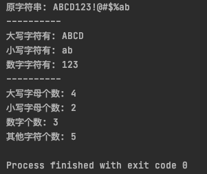
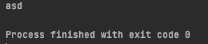
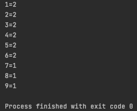
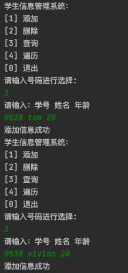
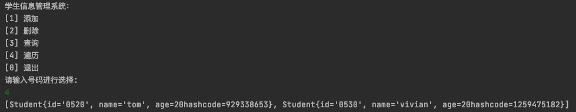
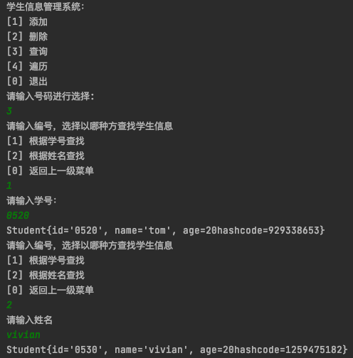
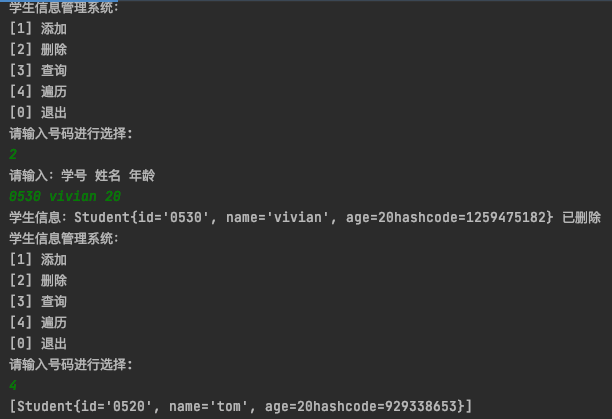
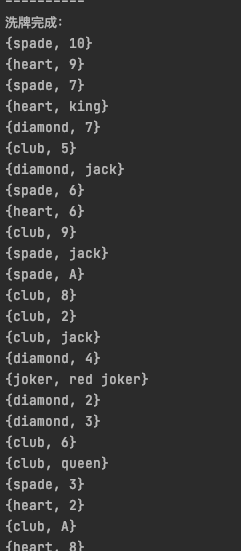
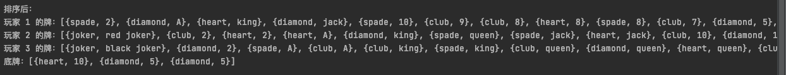

# 作业讲解

## 题目一

统计字符串"ABCD123!@#$%ab"中大写字母、小写字母、数字、其它字符的个数并打 印出来

思路：用正则表达式分别匹配字符串中 `大写字母、小写字母、数字字符`，剩下的是 `其他字符`

结果如下：

## 题目二

获取两个指定字符串中的最大相同子串

思路：将短的那个串进行长度依次递减的子串与较长的串比较

结果如下：

## 题目三

统计数字字符串出现的次数并打印

思路：将字符串转换为 char[] 数组，用 HashMap集合 记录每个数字字符出现的次数

结果如下：

## 题目四

学生信息管理系统

思路：

- Student 类：存放学生的 学号、姓名、年龄 的信息
- StudentInfoSystem 类：单例模式，学生信息管理系统类，包含 增、删、查、遍历 的方法
- StuInfoSysTest 类：用于测试学生信息管理系统

结果如下：

- 主菜单 和 添加学生信息

- 遍历学生信息

- 查找学生信息(可以根据 学号 或者 姓名 查找)

- 删除学生信息

## 题目五

扑克牌，斗地主游戏，洗牌、发牌、排序

思路：

- PokerCard 类：存储扑克牌的 花色、数值/名、用于排序的数值大小

- PokerGame 类：斗地主游戏类，包含 生成一副扑克牌、洗牌、玩家依次摸牌+底牌、排序、打印手牌 的方法

- PokerGameTest 类：实现 斗地主游戏类

结果如下：

- 洗牌

- 玩家摸牌和底牌

