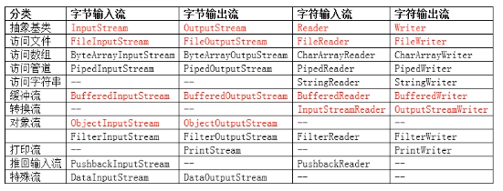
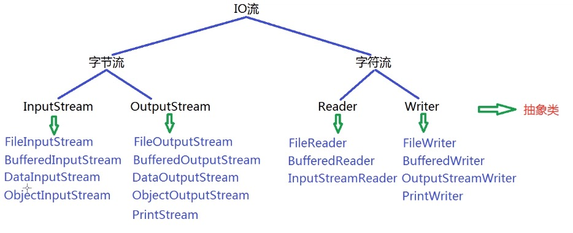
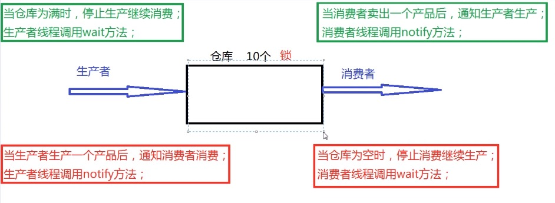
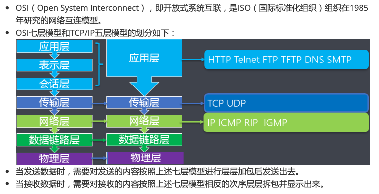

# Java 核心类库 二

[@TOC]

## 一、异常机制

`java.lang.Throwable`类是 `Error` 和 `Exception` 类的超类

Error 类主要描述java虚拟机无法解决的严重错误

Exception 类主要描述编程错误

### 1.1 异常的分类

两大异常：

- RuntimeException 运行时异常 / 非检测性异常

- IOException 和 其他异常 / 检测性异常，在编辑阶段能够被编译器检测出的异常

当程序执行过程发生异常，却没有处理时，JVM会按照默认方式处理：

- 输出异常名称、发生的原因、异常发生的位置
- 终止程序

### 1.2 异常的避免和捕获

```
try {

}
catch {

}
...

finally {

}
```

finally 关键字:

语句，无论是否发生异常都执行

### 1.3 异常的抛出

- 不建议在 main 方法中抛出异常，JVM的负担不少

- 异常抛出后，try 语句块内的代码不向下执行

- 父类子类间的抛出异常的关系 

	+ 可以抛出和父类相同的

	+ 可以抛出更小的异常

	+ 不可以抛出不同类型的

	+ 不可以抛出更大的异常

### 1.4 自定义异常

格式：

- 继承 Exception 类或者其子类
- 提供两个构造方法，无参构造 和 以字符串为参数的构造方法

如：

```
public class AgeException extends Exception {

    public AgeException() {
    }

    public AgeException(String message) {
        super(message);
    }
}
```

自定义异常的处理：

- 自定义异常时，就地处理
- 或者，逐级抛出异常

## 二、文件IO

### 2.1 File 类

概念:

`java.io.File`, 主要描述文件或目录路径的抽象表示信息，可以获取文件或目录的特征信息(文件大小等)

常用方法：

| 方法 | 说明 |
| :-- | -- |
| File(String pathname) | 根据路径构造对象 |
| File(String parent, String child) | 根据 |
|  |  |
|  |  |
|  |  |
|  |  |
|  |  |
|  |  |
|  |  |
|  |  |
|  |  |
|  |  |
|  |  |
|  |  |
|  |  |
|  |  |
|  |  |
|  |  |
|  |  |
|  |  |
|  |  |

### 2.2 IO 流

- 按照读取数据的基本单位

    + 字节流
    + 字符流

- 按照读写数据的方向
    
    + 输入流
    + 输出流

- 按照流的角色不同

    + 节点流: 直接和输入输出流对接的流
    + 处理流: 建立在节点流之上的流，间接和输入输出流对接

体系结构：



常见的IO流:




### 2.3 FileWriter 类

概念：

用于将文本内容写入到文本文件

| 方法 | 说明 |
| :-- | -- |
| FileWriter(String fileName) | 指定文件名构造对象 |
| FileWriter(String fileName, boolean append) | 以追加方式，指定文件名构造对象 |
| void write(int c) | 写入单个字符 |
| void write(char[] cbuf, int off, int len) |  |
| void write(char[] cbuf) |  |
| void flush() | 刷新流, 清除数据 |
| void close() | 关闭流对象，并释放资源 |

- FileWriter 的实例化对象，在未关闭之前，默认追加写入？

### 2.4 FileReader 类

| 方法 | 说明 |
| :-- | -- |
| FileReader(String fileName) | 指定文件名，构造对象 |
| int read() | 读取单个字符的数据，返回 -1 表示读取到末尾 |
| int read(char[] cbuf, int offset, int length) | 读取cbuf.length个字符的数据，返回 读取到的length，字符个数，返回 -1 表示读取到末尾 |
| int read(char[]) | 读取最多cbuf.length 个字符，返回 -1 表示读取到末尾 |
| void close() | 关闭流对象, 并释放资源 |

### 2.5 FileInputStream 类

字节读取文件，常用于读取图片

| 方法 | 说明 |
| :-- | -- |
| FileInputStream(String fileName) | 指定文件名，构造对象 |
| int read() | 读取单个字符的数据，返回 -1 表示读取到末尾 |
| int read(byte[] cbuf, int offset, int length) | 读取cbuf.length个字符的数据，返回 读取到的length，字符个数，返回 -1 表示读取到末尾 |
| int read(byte[]) | 读取最多cbuf.length 个字符，返回 -1 表示读取到末尾 |
| void close() | 关闭流对象, 并释放资源 |
| int avaliable() | 获取输入流所关联文件的大小 |


### 2.6 FileOutputStream 类

字节写入文件

| 方法 | 说明 |
| :-- | -- |
|  |  |
|  |  |
|  |  |
|  |  |


### 2.7 BufferedOutPutStream 类

| 方法 | 说明 |
| :-- | -- |
| BufferedOutputStream(OutputStream out) |  |
| BufferedOutputStream(OutputStream out, int size) |  |
|  |  |
|  |  |
|  |  |
|  |  |
|  |  |
|  |  |
|  |  |

> OutputStream 是一个抽象类，不能实例化对象；若参数的类型为此类，则应该传入其继承类

### 2.8 BufferedInputStream 类

| 方法 | 说明 |
| :-- | -- |
| BufferedInputStream(OutputStream out) |  |
| BufferedInputStream(OutputStream out, int size) |  |
|  |  |
|  |  |
|  |  |
|  |  |
|  |  |
|  |  |
|  |  |


> 缓冲字节流 比 文件字节流 效率要高

### 2.9 BufferedWriter 类

缓冲字符输出流

| 方法 | 说明 | 
| :-- | -- | 
| BufferedWriter(Writer out) | 参数指定的引用构造对象 | 
| BufferedWriter(Writer out, int size) | 指定缓冲区大小 | 
| void write(int c) | 写入单个字符到输出流 | 
| void write(char[] cbuf, int off, int len) |  | 
| void write(char[] cbuf) |  | 
| void write(String s, int off, int len) |  | 
| void write(String str) | 指定字符串内容，写入输出流 | 
| void newLine() | 用于写入行分隔符到输出流 | 
| void flush() | 刷新流 | 
| void close() | 关闭流对象 | 

### 2.10 BufferedReader 类

缓冲字符输入流

| 方法 | 说明 | 
| :-- | -- | 
| BufferedReader(Reader out) | 参数指定的引用构造对象 | 
| BufferedReader(Reader out, int size) | 指定缓冲区大小 | 
| int read() | 从输入流中读取单个字符, 返回读取到的字符内容，若读取到末尾返回-1 | 
| int read(char[] cbuf, int off, int len) | 从输入流中读取len个字符, 返回读取到的字符内容，若读取到末尾返回-1 | 
| int read(char[] cbuf) | 从输入流中读满这个数组cbuf, 返回读取到的字符内容，若读取到末尾返回-1 | 
| String readLine() | 读取一行字符串，并返回，若读取到末尾，则返回null | 
| void close() | 关闭流对象 | 

### 2.11 打印流 和 转换流

- PrintStream 类

| 方法 | 说明 |
| :-- | -- |
| PringStream(OutputStream out) | 构造对象 |
| void print(String s) |  |
| void println(String x) | 打印字符串后，终止该行 |
| void flush() | 刷新流 |
| void close() |  |


- PrintWriter 类

格式化，打印到文本输出流

| 方法 | 说明 |
| :-- | -- |
| PringWriter(Writer out) | 构造对象 |
| void print(String s) |  |
| void println(String x) | 打印字符串后，终止该行 |
| void flush() | 刷新流 |
| void close() |  |

案例：

不断提示用户输入要发送的内容，若发送的内容是“bye”，则聊天结束

否则，用户输入的内容写入到文件中

使用 BufferedReader 类来读取输入

使用 PrintStream 类负责将数据写入文件

- 转换流

    + InputStreamReader : 字节流 到 字符流 的转换

    + OutputStreamWriter : 字符流 到 字节流 的转换

### 2.12 字符编码

常见的编码表：

- ASCII: 美国标准信息交换码, 一个字节, 7位二进制，首位空
- ISO8859-1: 拉丁码表, 一个字节， 8位二进制
- GB2312: 中文编码表, 最多两个字节，16位二进制
- GBK: 更全的中文编码表, 最多两个字节，16位二进制
- Unicode: 国际编码表, 全部两个字节，16位二进制
- UTF-8: 变长的编码，1 - 4 个字节

### 2.13 DataOutputStream 类 和 DataInputStream 类

DataOutputStream 类 

将基本数据类型写入输出流

| 方法 | 说明 |
| :-- | -- |
| DataOutputStream(OutputStream out) |  |
| void writeInt(int v) | 将整数一次性写入输出流，优先写入高字节 |
| void close() | 关闭流 |

DataInputStream 类

| 方法 | 说明 |
| :-- | -- |
| DataOutputStream(OutputStream out) |  |
| void readInt(int v) | 将整数一次性读取输出流 |
| void close() | 关闭流 |

### 2.14 ObjectOutputStream 类 和 ObjectInputStream 类

ObjectOutputStream 类

- 只支持`java.io.Serializable`接口的对象
- 所以需要将对象序列化(对象 -> 字节序列)

| 方法 | 说明 |
| :-- | -- |
| void writeObject(Object obj) |  |
| void close() |  |


ObjectInputStream 类

反序列化

| 方法 | 说明 |
| :-- | -- |
| Object readObject() |  |
| void close() |  |

序列化版本号：

用于序列化版本验证

> transient 关键字，修饰后，该引用不会被序列化

> 如果需要序列化多个对象到同一个文件时，由于读取时返回的对象值无法判断是否读到末尾
> 
> 因此，可以将多个对象写入一个集合内，将该集合序列化，

### 2.15 RandomccessFile 类

随机访问文件内容的读写操作

| 方法 | 说明 |
| :-- | -- |
| RandomAccessFile(String name, String mode) | mode 有 <br /> r : 只读 <br /> rw: 读写 <br /> rwd: 读写，内容同步 <br /> rws: 读写，内容同步，元数据更新 |
| int read() | 读取单个字节 |
| void seek(long pos) | 设置偏移量 |
| void write(int b) |  |
| void close() |  |

> 每次 read 和 write 都会使偏移量增加1

## 三、多线程

### 3.1 基本概念

程序：

数据结构 + 算法。存放在硬盘上的可执行文件

进程：

运行在内存中的可执行文件, 多进程, 新建一个进程都会消耗计算机资源

线程：

进程内部的程序流, 多线程

多线程：

采用时间片轮转法，保证多个线程的并发执行。所谓并发指的是`宏观并行微观串行`的机制

### 3.2 线程的创建

- `java.lang.Thread` 类，描述线程，任何线程对象都是此类的实例

- 此类封装了复杂的线程开启等操作，封装了操作系统的差异性

创建方式：

- 自定义类，继承 `Thread` 类，重写 `run` 方法，创建该类的对象，调用 `start` 方法

- 自定义类，实现`Runnable`接口，重写 `run` 方法，创建该类的对象，作为是实参构造 `Thread` 类的对象，调用 `start` 方法

| 方法 | 说明 |
| :-- | -- |
| Thread() |  |
| Thread(String name) |  | 
| Thread(Runnable target) |  |
| Thread(Runnable target, String name) |  |
| void run() | 若使用Runnable引用，构造了线程对象，调用该方法时，会调用接口中的 <br />  若不使用Runnable引用构造对象，则调用此方法时，不执行任何指令 |
| void start() | 启动线程，jvm会自动调用该线程的run方法 |

> start 方法会启动新的线程，和 main方法是两个线程

匿名内部类 实现线程的创建和启动:

> 为什么使用匿名内部类启动线程？
> 
> 因为如果线程类要实现或者继承父类才能启动线程，那么该类的“继承机会”会被占用，导致后期代码维护困难

> 格式： 父类/接口类型 引用变量名 = new 父类/接口类型() { 方法重写 };

### 3.3 线程的生命周期

- 新建状态：new
- 就绪状态：start 方法后    
- 运行状态：系统调度器调度该线程后
- 消亡状态：线程执行完成后
- 阻塞状态：执行过程中发送阻塞事件后(阻塞状态解除后，进入就绪状态)

### 3.4 线程的编号和名称

| 方法 | 说明 |
| :-- | -- |
| long getId() | 获取调用对象所表示线程的编号 |
| String getName() | 获取调用对象所表示线程的名称  |
| void setName(String name) | 修改名称 |
| static Thread currentThread() | 获取当前正在执行线程的引用 |

案例：

- 自定义类，继承 Thread 类, 重写 run 方法
- 在 run 方法中，先打印当前线程的编号和名称
- 然后修改线程名称，再次打印
- 在main方法中，打印主线程的编号和名称

### 3.5 常用方法

| 方法 | 说明 |
| :-- | -- |
| static void yield() | 当前线程让出处理器，进入等待状态 |
| static void sleep(times) | 当前线程进入阻塞状态，times单位是毫秒 |
| int getPriority() | 获取线程的优先级 |
| void setPriority(int newPriority) | 修改线程的优先级, 优先级越高不一定先执行，但是获取时间片的机会更多 | 
| void join() | 等待该线程终止 |
| void join(long millis) | 等待该线程终止, 最多等地啊多少毫秒 |
| boolean isDaemon() | 用于判断是否为守护线程 |
| void setDaemon(boolean) | 用于设置线程为守护线程 |

> 当子线程不是守护线程时，主线程结束后，子线程继续执行
> 
> 子线程是守护线程时，主线程结束后，子线程也结束

案例：

- 创建两个线程，一个打印 1～100内的奇数，另一打印 1～100 内的偶数
- main方法中启动两个线程，主线程结束后，等待两个线程终止

### 3.6 线程同步

多个线程同事访问共享资源是，需要协调线程之间的通信

- 异步操作：多线程并发的操作，各自独立运行
- 同步操作：多线程串行的操作，先后执行的顺序

实现方式：

> synchronized 关键字，实现 同步/对象锁 机制，保证线程执行的原子性

- 同步代码块

    ```
    synchronized(类类型的引用) {
        编写所有需要锁定的代码
    }
    ```

- 同步方法

    用关键字修饰整个方法

    即，

    ```
    synchronized(this) {
        整个方法体的代码
    }
    ```

    > this 指向线程作用的对象，因为是该对象调用 run方法，启动线程

    > 对一个静态方法加锁时，其对象是类对象, 如 `public synchronized static void xxx(){...}`

    > 多个需要同步的线程在访问同步块时，应该作用于同一个锁对象引用

    > 在使用同步快时，应当减少同步代码的范围，以提高并发的执行效率

### 3.7 线程安全类 和 线程不安全类

`Coolections.synchronizedList()`

`Coolections.synchronizedMap()`

是线程安全类（有同步锁）

### 3.8 死锁

```
public void run() {
    synchronized(a) {   // 持有对象a, 等待对象b
        synchronized(b) {
            锁定的代码
        }
    }
}
```

```
public void run() {
    synchronized(b) {   // 持有对象b, 等待对象a
        synchronized(a) {
            锁定的代码
        }
    }
}
```

a 和 b 互相等待，形成死锁

> 开发中，尽量减少同步的资源，减少同步代码快的潜逃结构

### 3.9 使用 Lock 实现线程同步

`java.util.concurrent.locks.Lock` 接口，控制多个线程对共享资源进行访问的工具

实现类 ReentrantLock 类, 与synchronized 具有相同的并发性

在线程安全控制中，经常使用该类显式加锁和释放锁

常用方法：

| 方法 | 说明 |
| :-- | -- |
| ReentrantLock() | 使用无参构造对象 |
| void lock() | 获取锁 |
| void unlock() | 释放锁 |

与 synchronized 类比较:

- Lock 显示锁, 需要手动开启或关闭
- Lock 只有同步代码块方式的锁
- Lock锁使用时，jvm用于调度线程的时间花费较小，因此性能较好

Object 类中，线程相关的方法：

| 方法 | 说明 |
| :-- | -- |
| void wait() | 让线程进入等待状态，直到其他线程调用notify() 或者 notifyAll() 方法 |
| void wait(long timeout) | 进入等待状态，直到多少毫秒后 |
| void notify() | 唤醒单个等待的线程 |
| void notifyAll() | 唤醒所有等待的线程 |

> wait 和 notify 需要在锁定的代码中调用

### 3.10 生产者 和 消费者 模型



### 3.11 第三种线程创建方式

实现 Callable 接口:

重写如下方法

| 方法 | 说明 |
| :-- | -- |
| V call() |  |

FutureTask 类:

该类提供了Future接口的基本实现，包括启动和取消计算、查询计算是否完成 和 检索计算结果的方法

用于获取方法调用后的返回结果

| 方法 | 说明 |
| :-- | -- |
| FutureTask(Callable<v> callable) | 根据指定的引用，创建一个未来对象 |
| V get() | 获取call方法的计算结果 |

### 3.12 线程池

概念：

- 创建一些线程，它们的集合叫做线程池

- 使用线程后不关闭，而是回到线程池中

- 任务提交给线程池，而不是直接给某个线程

- 一个线程只能同时执行一个任务，但是线程池可以同时接受多个任务

`java.util.concurrent.Executors` 类

`java.util.concurrent.ExecutorService` 接口

> Executors 是工具类和线程池的工厂类，可以创建并返回不同类型的线程池

| 方法 | 说明 |
| :-- | -- |
| static ExecutorService newCachedThreadPool() | 可根据需要创建新线程的线程池 |
| static ExecutorService newFixedThreadPool(int nThreads) | 可重用固定线程的线程池 |
| static ExecutorService newSingleThreadExecutor() | 只有一个线程的线程池 |

> ExecutorService 接口是线程池接口，实现类是 ThreadPoolExecutor

| 方法 | 说明 |
| :-- | -- |
| void executr(Runnable command) | 执行任务和命令，通常用于执行Runnable |
| `<T>Future<T> submit(Callable<T> task)` | 执行任务和命令，通常用于执行Callable |
| void shutdown() | 有序关闭 |


## 四、网络编程

### 4.1 七层网络模型

OSI模型 和 CP/IP 模型



### 4.2 相关协议

计算机之间通讯的统一规则

TCP 协议 (Transmission Control Protocol)

- 面向连接的协议
- 三次握手(目的：形成数据传输通道，保证全程保持连接，保证数据传输的可靠性和有序性)
- 四次握手
- 全双工的字节流 通信方式，可进行大数据量的传输
- 传输完毕后，需要释放已建立的连接，发送数据的效率比较低


UDP 协议 (User Datagrom Protocol)

- 非面向连接的协议
- 通信过程不需要保持连接
- 不保证数据传输的可靠性和有序性
- 全双工数据报 通信方式，每个数据报的大小 <=64K
- 发送数据完毕后，不需要释放资源，开销小，发送数据的效率高

### 4.3 IP 地址

互联网中的唯一地址标示

- IPV4: 32位二进制组成的整数
- IPV6: 128位二进制组成的整数

采用点分十进制表示法，来描述ip地址。每一个字节的二进制都转化为一个十进制数

如，ipv4 有32个二进制位，四个字节，即 192.168.1.1

查看ip地址的方式：

- wins：cmd - ipconfig 或者 ipconfig/all
- linux: terminal - ifconfig 或者 /sbin/ifconfig

特殊的地址:

表示当前计算机本身，本地回环地址(hostAddress): 127.0.0.1 主机名（hostName) : localhost

### 4.4 端口号

可以定位到该ip地址指向的设备中的某一个进程

由 16位二进制组成的整数，表示范围：0 ～ 65535, 其中 0 ～ 10240 的端口，通常是系统占用的端口

| 特殊的端口 | 端口号 |
| :-- | -- |
| HTTP | 80 |
| FTP | 21 |
| Oracle | 1521 |
| MySQL | 3306 |
| Tomcat | 8080 |

Socket：

网络套接字, IP地址 + 端口

### 4.5 TCP 协议的编程模型

C/S 构架的简介:

- 客户端向服务器发出服务请求，服务器接受请求后提供服务
- 客户端部分：每个用户所专有的，负责执行前台功能
- 服务器部分：由多个用户共享的信息与功能，招待后台服务

编程模型：

- 服务器：

    + 创建 ServerSocket 类型的对象，并提供端口号
    + 等待客户端的连接需求，调用 accept() 方法
    + 使用输入输出流通信
    + 关闭 Socket
    
- 客户端：

    + 创建 Socket 类型的对象，并提供服务器的IP地址和端口号
    + 使用输入输出流进行通信
    + 关闭 Socket

相关类和方法：

`ServerSocket` 类：(用于描述服务器端套接字信息)

| 方法 | 说明 |
| :-- | -- |
| ServerSocket(int port) | 根据指定的端口号构造对象 |
| Socket accept() | 侦听并接受到此套接字的连接需求 |
| void close() | 关闭套接字 |

`Socket` 类

用于描述客户端的套接字信息

| 方法 | 说明 |
| :-- | -- |
| Socket(String host, int port) | 根据主机名和端口，构造对象 |
| InputStream getInputStream() | 获取当前套接字的输入流 |
| OutputSream getOutputSream() | 获取当前套接字的输出流 | |
| void close() | 关闭套接字 |

### 4.6 UDP协议的编程模型

编程模型：

- 接收方

    + 创建 DatagramSocket 类的对象，并提供端口
    + 创建 DatagramPacket 类的对象，并提供缓冲区
    + 通过 Socket 接受数据内容，并存放到 Packet 中，调用 receive 方法
    + 关闭 Socket

- 发送方

    + 创建 DatagramSocket 类的对象
    + 创建 DatagramPacket 类的对象, 并提供接收方的通信地址
    + 通过 Socket 将 Packet中饿数据内容发送出去，调用 send 方法
    + 关闭 Socket

相关类和方法:

`DatagramSocket` 类

> 描述发送和接收数据报的套接字

| 方法 | 说明 |
| :-- | -- |
| DatagramSocket() | 无参构造 |
| DatagramSocket(int port) | 指定端口号，构造对象 |
| void receive(DatagramPacket p) | 接收数据报，存放到参数指定的位置 |
| void send(DatagramPacket p) | 将参数指定的数据报发送出去 |
| void close() | 关闭对象 |


`DatagramPacket` 类

> 描述数据报，用以实现无连接数据投递服务

| 方法 | 说明 |
| :-- | -- |
| DatagramPocket(byte[] buf, int length) | 根据参数指定的数组，构造对象，用以接收长度为length的数据报 |
| DatagramPocket(byte[] buf, int length, InetAddress address, int port) | 根据参数指定的数组，构造对象，将数据报发送到指定地址和端口 |
| InetAddress getAddress() | 获取发送方或接收方的通信地址 |
| int getPort() | 获取发送方或接收方的端口号 |
| int getLength() | 获取发送数据或接收数据的长度 |

`InetAddress` 类

> 描述互联网通信地址信息

| 方法 | 说明 |
| :-- | -- |
| static InetAddress getLocalHost() | 获取当前主机的通信地址 |
| static InetAddress getByName(String host) | 获取指定主机名的通信地址 |

### 4.7 URL 类

Uniform Resouce Identifier 表示统一的资源定位器

资源可以是文件或者目录，也可以是对象的引用

- 通过URL可以访问万维网上的网络资源
- 基本结构：<传输协议>://<主机名>:<端口号>/<资源地址>

| 方法 | 说明 |
| :-- | -- |
| URL(String spec) |根据参数指定的字符串信息构造对象 |
| String getProtocol() | 获取协议名称 |
| String getHost() | 获取主机名称 |
| int getPort() | 获取端口号 |
| String getPath() | 获取路径信息 |
| String getFile() | 获取文件名 |
| URLConnection openConnection() | 获取URLConnection 类的实例 |

### 4.8 URLConnection 类

表示应用程序和URL之间的通信链接

主要实现类有支持 HTTP的 HttpURLConnection类

| 方法 | 说明 |
| :-- | -- |
| InputStream getInputStream() | 获取输入流 |
| void disconnect() | 断开连接 |


## 五、反射机制

### 5.1 基本概念

动态编程技术：

在某些场景中，编写代码时不确定要创建什么类型的对象，也不确定要调用什么样的方法，通过运行时传递的参数来决定

这种机制，称为动态编程，也叫反射机制

> 动态创建对象，并且动态调用方法的机制


### 5.2 Class 类

`java.lang.Class` 类的实例，可以用于描述类和接口，也是一种数据类型

该类没有公共构造方，其实例有jvm和类加载器自动构造完成，是加载到内存中的运行时类

获取Class 对象的方式:

- 使用数据类型 .class 方式获取对应类型的Class对象
- 使用引用/对象.getClass() 方式，获取对应类型的Class 对象
- 使用包装类 .TYPE 的方式，获取基本数据类型的Class 对象
- 使用 Class.forName 方式, 获取指定类型的 Class 对象(不能获取基本数据类型)
- 使用类加载器 ClassLoader

常用方法：

| 方法 | 说明 |
| :-- | -- |
| static Class<?>forName(String className) | 获取指定类型对应的Class 对象，并返回 |
| T newInstance() | 创建该Class对象所表示类的新实例 |

| 方法 | 说明 |
| :-- | -- |
| Constructor<T> getConstructor(Class<?> parameterTypes) | 获取此Class对象所表示类型中参数指定的公共构造方法 |
| Constructor<?>[] getConstructors() | 获取此Class对象所表示类型中所有的公共构造方法 |

| 方法 | 说明 |
| :-- | -- |
| Field getDeclareField(String name) | 获取此Class对象表示的类中参数指定的单个成员变量信息 |
| Field[] getDeclareFields() | 获取所有成员变量信息 |

| 方法 | 说明 |
| :-- | -- |
| Method getMethod(String name, Class<?>...parameterTypes) | 用于获取该Class对象表示类中名字为name，参数为parameterTypes的公共成员方法 |
| Method[] getMethods() | 获取该Class对象表示类中所有公共成员方法 |

### 5.3 Constructor 类

描述获取到的`构造方法`信息

| 方法 | 说明 |
| :-- | -- |
| T newInstance(Object... Initargs) | 使用此 Constructor对象描述的构造方法来构造Class对象代表类型的实例 |
| int getModifiers() | 获取方法的访问修饰符 |
| String getName() | 获取方法的名称 |
| Class<?>[] getParameterTypes() | 获取方法所有参数的类型 |

### 5.4 Field 类

描述获取到的单个`成员变量`信息

| 方法 | 说明 |
| :-- | -- |
| Object get(Object obj) | 获取参数对象obj中，此Field对象所表示成员变量的数值 |
| void set(Object obj, Object value) | 修改参数对象obj中，此Field对象所表示成员变量的数值  |
| void setAccessible(boolean falg) | true 则反射对象在使用时，取消java语言访问检查 |
| int getModifiers() | 获取成员变量的修饰符 |
| Class<?> getType() | 获取成员变量的数据类型 |
| String getName() | 获取成员变量的名称 |

> 获取成员变量数值时，该成员变量的修饰符不能时private?
> 
> 调用 setAccessible() 方法，将访问检查取消掉，可以暴力访问private修饰的成员变量

### 5.5 Method 类

描述获取到的单个`成员方法`信息

| 方法 | 说明 |
| Object invoke(Object obj, Object...args) | 使用obj对象来调用此 Mothod对象所表示的成员方法，实参传递args |
| int getModifiers() | 获取方法的访问修饰符 |
| Class<?> getReturnType() | 获取方法的返回值类型 |
| String getName() | 获取方法的名称 |
| Class<?>[] getParameterTypes() | 获取方法所有参数的类型 |
| Class<?>[] getExceptionTypes() | 获取方法的异常信息 |

### 5.6 获取其他结构信息

| 方法 | 说明 |
| :-- | -- |
| Package getPackage() | 获取所在的包信息 |
| Class<?supter T> getSuperClass() | 获取继承的父类信息 |
| Class<?>[] getInterface() | 获取实现的所有接口 |
| Annotation[] getAnnotations() | 获取注解信息 |
| Type[] getGenericInterfaces() | 获取泛型信息 |


## 六、作业

1. 编程题 

    基于学生信息管理系统增加以下两个功能： 

        a.自定义学号异常类和年龄异常类，并在该成员变量不合理时产生异常对象并抛出。 

        b.当系统退出时将 List 集合中所有学生信息写入到文件中，当系统启动时读取文件中所 有学生信息到 List 集合中。

2. 编程题 

    实现将指定目录中的所有内容删除，包含子目录中的内容都要全部删除。 

3. 编程题 

    使用线程池将一个目录中的所有内容拷贝到另外一个目录中，包含子目录中的内容。 

4. 编程题 

    使用基于 tcp 协议的编程模型实现将 UserMessage 类型对象由客户端发送给服务器； 

    服 务 器接 收到 对象 后判 断 用户 对象 信息 是否 为 "admin" 和 "123456"， 若 是则 将 UserMessage 对象中的类型改为"success"，否则将类型改为"fail"并回发给客户端，客户 端接收到服务器发来的对象后判断并给出登录成功或者失败的提示。 

    其中 UserMessage 类的特征有：类型(字符串类型) 和 用户对象(User 类型)。

    如： 

    > UserMessage tum = new UserMessage("check", new User("admin", "123456"));  


    作业说明：

    1、提供编程代码，代码记得要加注释，方便导师能通过浏览代码明白你的程序执行流程；

    2、提供程序运行和讲解的视频（程序运行包含：按照作业要求体现程序执行结果；讲解内容包含：题目分析、实现思路、代码讲解。）

    3、当前模块学习过程中的笔记，可以以文档、照片、思维导图的形式提供；

    4、本次作业的内容，分三个文件夹，code（每个题单独一个文件夹）、运行视频、学习笔记；

    5、要求控制台打印出程序的执行流程和最后结果，第二题和第三题不可忽略，将正在复制和正在删除的文件名字打印到控制台中


