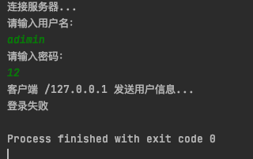

1. 编程题 

    基于学生信息管理系统增加以下两个功能： 

        a.自定义学号异常类和年龄异常类，并在该成员变量不合理时产生异常对象并抛出。 

        b.当系统退出时将 List 集合中所有学生信息写入到文件中，当系统启动时读取文件中所 有学生信息到 List 集合中。

	结果：

	学号异常和年龄异常

	
	

	系统启动时，载入数据

	

  	系统退出时，输出数据到文件

	

2. 编程题 

    实现将指定目录中的所有内容删除，包含子目录中的内容都要全部删除。 

	结果：

	

3. 编程题 

    使用线程池将一个目录中的所有内容拷贝到另外一个目录中，包含子目录中的内容。 

	思路：

	线程池接受任务，启动线程，遇到文件则拷贝，遇到目录则创建, 递归调用

	结果:

	

4. 编程题 

    使用基于 tcp 协议的编程模型实现将 UserMessage 类型对象由客户端发送给服务器； 

    服 务 器接 收到 对象 后判 断 用户 对象 信息 是否 为 "admin" 和 "123456"， 若 是则 将 UserMessage 对象中的类型改为"success"，否则将类型改为"fail"并回发给客户端，客户 端接收到服务器发来的对象后判断并给出登录成功或者失败的提示。 

    其中 UserMessage 类的特征有：类型(字符串类型) 和 用户对象(User 类型)。

	结果：

	登录失败

	

	登录成功

	